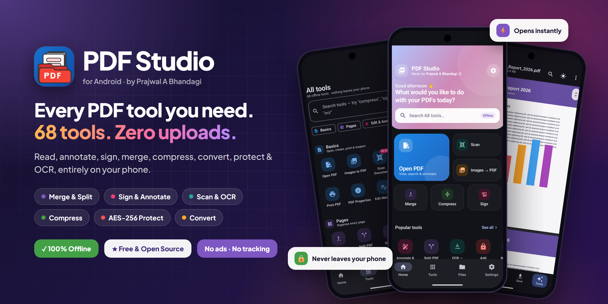
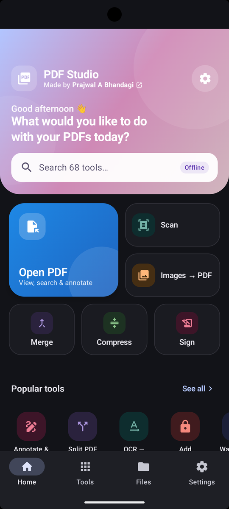
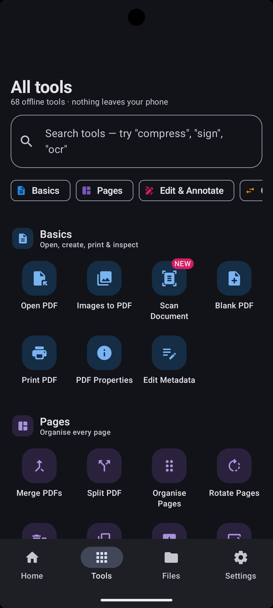
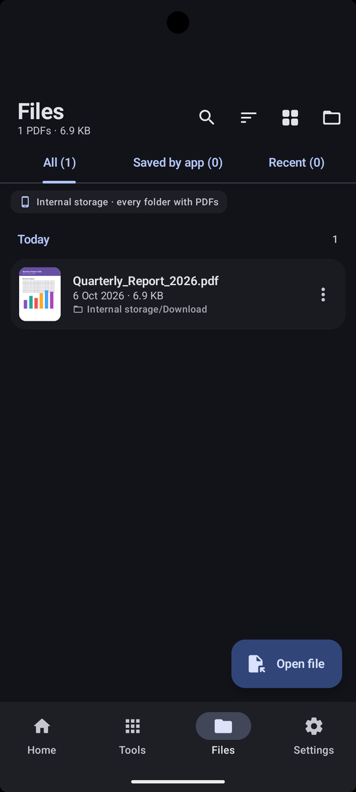
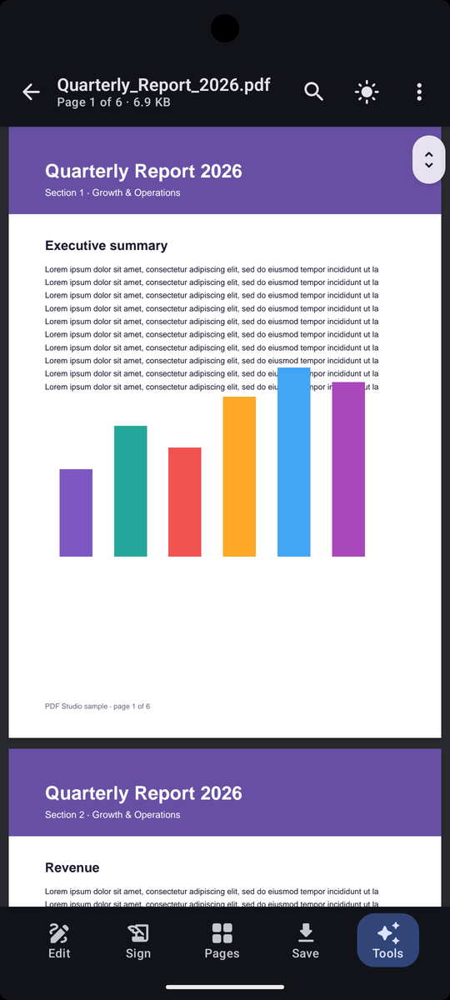
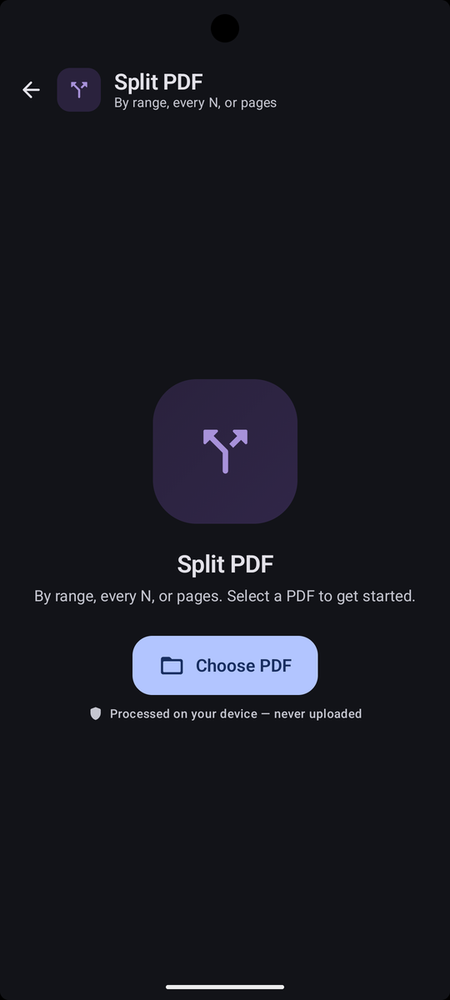
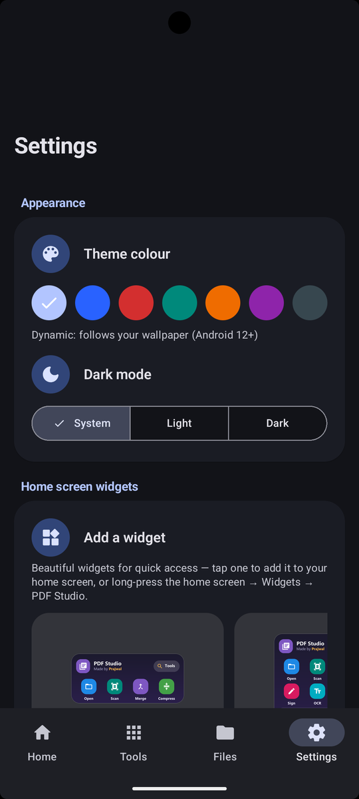
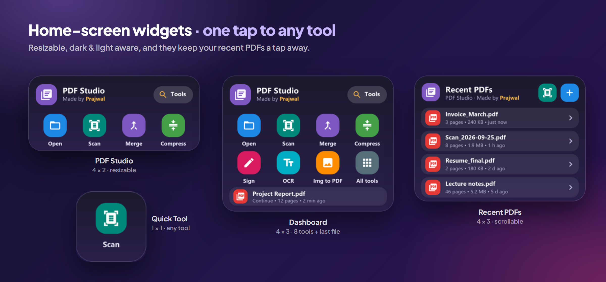

<div align="center">



# PDF Studio

**The complete PDF toolkit for Android: 68 tools, fully offline, free forever.**
Read, annotate, sign, merge, split, compress, convert, protect, scan and OCR, and your documents never leave your phone.

[](https://github.com/prajwal032004/pdf-studio/releases/latest)
[](https://github.com/prajwal032004/pdf-studio/stargazers)
[](LICENSE)


[**Download APK**](https://github.com/prajwal032004/pdf-studio/releases/latest) · [Features](#-features) · [Screenshots](#-screenshots) · [Build from source](#-build-from-source) · [Contributing](#-contributing)

</div>

---

## ✨ Why PDF Studio?

Most PDF apps upload your files to a server, show ads, or lock basic tools behind a subscription. PDF Studio does none of that.

| | |
|---|---|
| 🔒 **Private by design** | Every tool runs on your device, including OCR, barcode reading and signature checks. Your documents are never uploaded. |
| ⚡ **Fast** | Most PDFs open without a full parse, and reopening a file is instant. |
| 🧰 **68 tools in one app** | Viewer, editor, converter, scanner, OCR, security and forms, so you don't need 10 separate apps. |
| 🎨 **Modern Material You design** | Built with Jetpack Compose and Material 3: dynamic colour, dark mode and tablet layouts. |
| 💸 **Free & open source** | MIT-licensed, no ads, no account, no paywall. |

---

## 📱 Screenshots

<div align="center">

| Home | All tools | Files |
|:---:|:---:|:---:|
|  |  |  |

| PDF reader | Tools | Settings |
|:---:|:---:|:---:|
|  |  |  |

**Home-screen widgets**



</div>

---

## 🚀 Features

### 📖 Smart PDF reader
- Pinch and double-tap zoom with a focal point, continuous or single-page mode
- Night and sepia reading themes, full-screen mode and a page scrubber
- Full-text search, and it reopens each PDF where you left off
- Open PDFs from any app through **Open with** or the **Share** sheet

### 🧰 68 tools in 11 categories

<details open>
<summary><b>📄 Basics</b> (7 tools)</summary>

Open PDF · Images to PDF · Scan Document (auto-crop) · Blank PDF · Print PDF · PDF Properties · Edit Metadata
</details>

<details>
<summary><b>🗂️ Pages</b> (11 tools)</summary>

Merge PDFs · Split PDF (by range, every N pages, or selected pages) · Organise Pages (drag to reorder) · Rotate · Delete · Duplicate · Add Blank Pages · Extract · Insert from PDF · Replace Pages · Move Between PDFs
</details>

<details>
<summary><b>✍️ Edit & Annotate</b> (7 tools)</summary>

Annotate & Draw (pen, shapes, highlights) · Sign PDF · Add Text · Highlight / Underline / Strike · Comments & Sticky Notes · Stamps & Dates · Add Image / Logo
</details>

<details>
<summary><b>🔄 Convert</b> (6 tools)</summary>

PDF → Images (PNG/JPG) · PDF → Text · Text → PDF · Markdown → PDF · HTML → PDF · Saved Webpage → PDF
</details>

<details>
<summary><b>🗜️ Compress</b> (3 tools)</summary>

Compress PDF · Image Quality (resolution & JPEG quality) · Remove Metadata
</details>

<details>
<summary><b>🔐 Security</b> (3 tools)</summary>

Add Password (AES-256) · Remove Password · Permissions (restrict print, copy, edit)
</details>

<details>
<summary><b>🔍 OCR & Scan</b> (5 tools)</summary>

OCR → Searchable PDF · Extract Scanned Text · Auto Orientation · Deskew Scans · Remove Blank Pages
</details>

<details>
<summary><b>🔖 Organise</b> (7 tools)</summary>

Bookmarks · Table of Contents · Page Labels (i, ii, iii… A-1…) · Header & Footer · Page Numbers · Watermark (text or image) · Bates Numbering
</details>

<details>
<summary><b>🔎 Search & Text</b> (3 tools)</summary>

Search & Highlight · Word Count · Find & Replace
</details>

<details>
<summary><b>🖼️ Page & Image</b> (4 tools)</summary>

Crop Pages (manual or auto) · Resize Pages (A4, Letter, custom) · Grayscale · Embedded Images (extract, replace, remove)
</details>

<details>
<summary><b>🧪 Advanced</b> (12 tools)</summary>

Redact · Find Sensitive Info (emails, phones, card numbers, IDs, then redact) · Fill Form · Create Form · Flatten · Verify Digital Signatures · PDF/A (validate & convert) · Find Duplicate Pages · Detect Blank Pages · QR & Barcode Reader · Batch Process · Repair PDF
</details>

### 📂 Built-in file manager
- Every PDF on your phone in **All**, **Saved by app** and **Recent** tabs, with folder paths
- Sorting, multi-select, rename, delete and quick preview
- Storage view that shows PDF space by folder and finds duplicate copies

### 🧩 Home-screen widgets
- **PDF Studio** (4×2, resizable): Open, Scan, Merge and Compress in one tap
- **Dashboard** (4×3): eight quick tools plus your last file
- **Recent PDFs** (4×3, scrollable): reopen recent files instantly
- **Quick Tool** (1×1): a shortcut to any tool you choose

---

## 🛡️ Privacy

- ✅ All processing happens **on-device**, including OCR (Google ML Kit on-device models).
- ✅ **No account, no ads, no analytics** on your documents.
- ✅ Files you create stay in PDF Studio's folder until you save or share them.
- ✅ Fully open source, so you can read every line of code yourself.

---

## 📥 Download

1. Go to the [**latest release**](https://github.com/prajwal032004/pdf-studio/releases/latest).
2. Download `PDF-Studio-v2.2.0.apk`.
3. Open it on your phone and allow **Install unknown apps** when Android asks.

> **Requirements:** Android 7.0 (API 24) or newer, on an ARM phone or tablet (arm64-v8a / armeabi-v7a).

---

## 🛠️ Tech stack

| Layer | Technology |
|---|---|
| Language | [Kotlin](https://kotlinlang.org/) 2.2 + Coroutines |
| UI | [Jetpack Compose](https://developer.android.com/jetpack/compose), Material 3, Material You dynamic colour |
| PDF engine | [PdfBox-Android](https://github.com/TomRoush/PdfBox-Android) + Android `PdfRenderer` |
| OCR & scanning | [Google ML Kit](https://developers.google.com/ml-kit): text recognition, barcode scanning, document scanner |
| Navigation | Navigation Compose |
| Widgets | `AppWidgetProvider` + `RemoteViews` |
| Build | Gradle (Kotlin DSL), version catalog, R8 minification & resource shrinking |
| Testing | JUnit, Robolectric, Roborazzi screenshot tests |

---

## 🏗️ Project structure

```
app/src/main/java/com/example/
├── core/            # PDF engine: page, text, image, OCR, security, forms, conversion ops
├── navigation/      # NavHost, tab routes, adaptive navigation rail
├── tools/
│   ├── settings/    # Settings screen
│   ├── viewer/      # PDF reader
│   └── webview/     # Offline HTML rendering
├── ui/
│   ├── common/      # Shared Compose components
│   ├── editor/      # Annotation & signature editor
│   ├── files/       # File manager, folder browser, storage
│   ├── home/        # Home screen & bottom navigation
│   ├── theme/       # Material 3 theme, colours, typography
│   └── tools/       # Tool catalog and all 68 tool screens
├── utils/           # File & PDF helpers, PDF index
└── widget/          # Home-screen widgets
```

---

## 🧑‍💻 Build from source

**Prerequisites:** [Android Studio](https://developer.android.com/studio) (latest stable) and JDK 17+.

```bash
# 1. Clone
git clone https://github.com/prajwal032004/pdf-studio.git
cd pdf-studio

# 2. Build a debug APK
./gradlew assembleDebug          # Windows: gradlew.bat assembleDebug

# 3. Install on a connected device
./gradlew installDebug
```

The APK is written to `app/build/outputs/apk/debug/`.

### Signed release build

Release signing keys are never stored in the repository. To sign with your own key:

```bash
# Create a key once
keytool -genkeypair -v -keystore my-upload-key.jks -keyalg RSA -keysize 2048 -validity 10000 -alias upload

# Copy the template and fill in your passwords
cp keystore.properties.example keystore.properties

./gradlew assembleRelease
```

You can also use the environment variables `KEYSTORE_PATH`, `STORE_PASSWORD`, `KEY_ALIAS` and `KEY_PASSWORD`, which is handy for CI. If neither is set, the release build is signed with the debug key so it still installs for testing.

---

## 🗺️ Roadmap

- [ ] F-Droid and Google Play releases
- [ ] More languages
- [ ] PDF → Word / Excel export
- [ ] Side-by-side PDF compare
- [ ] Cloud-free sync between your own devices

Have an idea? [Open a feature request](https://github.com/prajwal032004/pdf-studio/issues/new).

---

## 🤝 Contributing

Contributions are very welcome, whether it's a bug report, a new tool, a translation or a UI polish.

1. Fork the repository
2. Create a branch: `git checkout -b feature/amazing-tool`
3. Commit your changes: `git commit -m "Add amazing tool"`
4. Push: `git push origin feature/amazing-tool`
5. Open a Pull Request

Please keep every feature **offline**: PDF Studio never uploads user documents.

---

## ⭐ Support the project

If PDF Studio saves you time, please **[give it a star](https://github.com/prajwal032004/pdf-studio/stargazers)**. It helps other people find the app.

[](https://star-history.com/#prajwal032004/pdf-studio&Date)

---

## 📄 License

PDF Studio is released under the [MIT License](LICENSE).

It uses these open-source libraries: PdfBox-Android (Apache 2.0), Jetpack Compose & AndroidX (Apache 2.0), Kotlin Coroutines (Apache 2.0) and Google ML Kit ([ML Kit Terms](https://developers.google.com/ml-kit/terms)).

---

<div align="center">

Made with ❤️ in India by **[Prajwal A Bhandagi](https://github.com/prajwal032004)**

</div>
